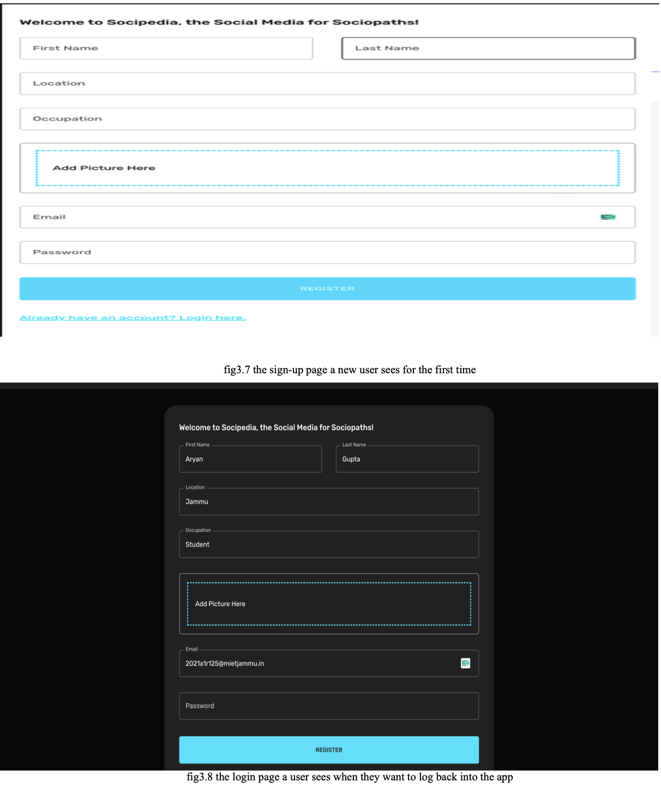
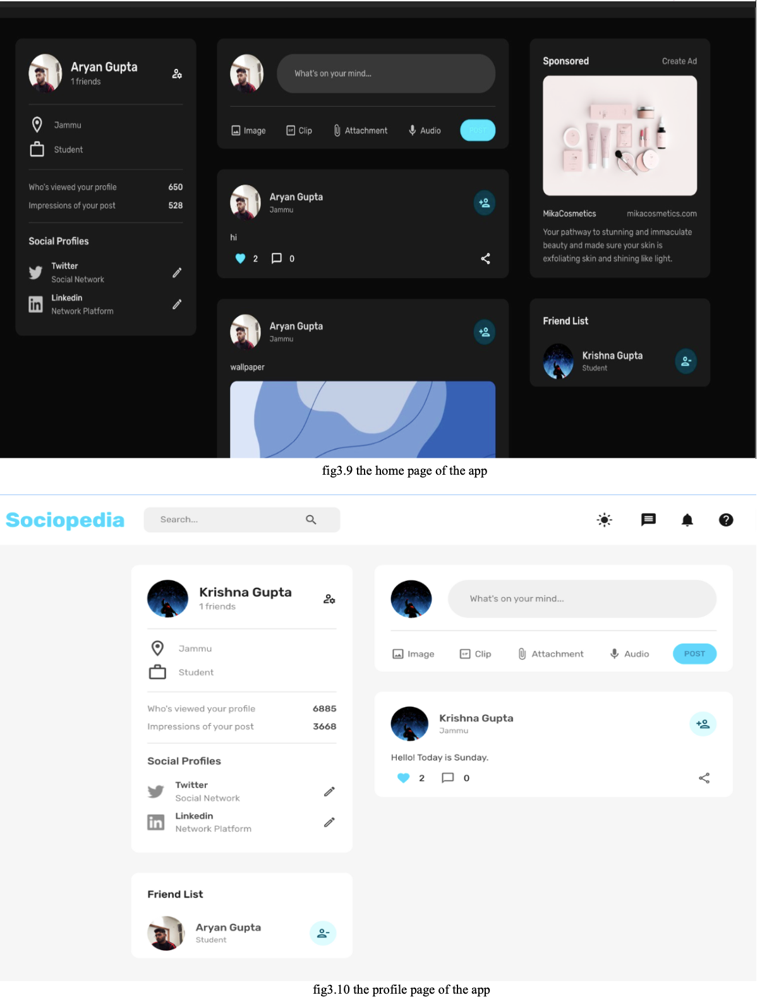
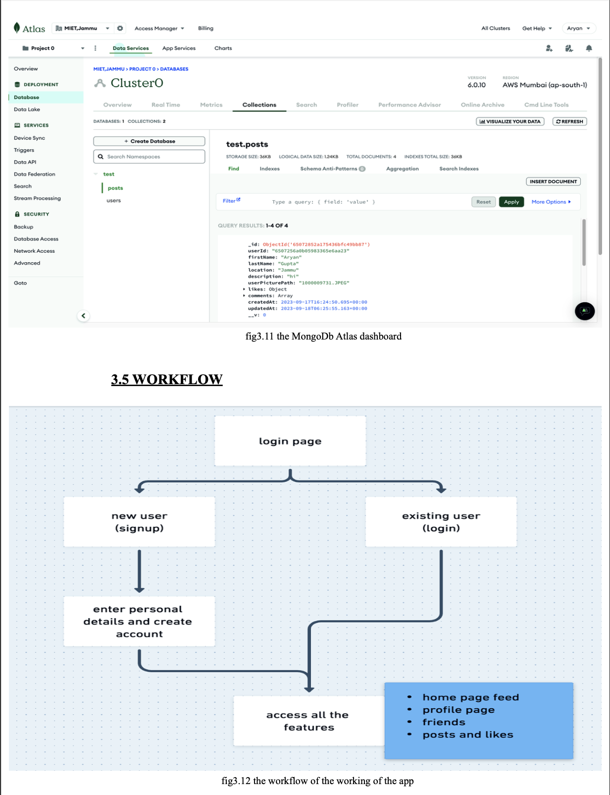

Here’s a complete README template for your **FullStack Social Media App - Sociopedia**. Feel free to adjust any details as needed.

---

# FullStack Social Media App - Sociopedia

**Sociopedia** is a full-stack, responsive social media application built with the MERN stack. This project demonstrates the development of a feature-rich social media platform with user authentication, interactive features such as likes, and a dark mode option.

## Features

- **User Authentication:** Secure login and registration using JWT (JSON Web Tokens).
- **Profile Management:** Users can create and manage their profiles, including profile pictures and personal information.
- **Social Interaction:** Post updates, like and comment on posts, and follow other users.
- **Responsive Design:** Optimized for both desktop and mobile devices, ensuring a seamless user experience across different screen sizes.
- **Dark Mode:** Toggle between light and dark themes for improved usability and aesthetic flexibility.
- **Real-time Updates:** Dynamic content updates without requiring page reloads.

## Technologies Used

- **Frontend:**
  - **React:** For building the user interface and managing application state.
  - **Material-UI (MUI):** For styling and responsive design components.
  - **Axios:** For making HTTP requests to the backend.

- **Backend:**
  - **Node.js:** For server-side logic and handling API requests.
  - **Express.js:** For building the RESTful API.
  - **MongoDB:** For database management and storing user data and posts.
  - **JWT:** For secure user authentication and session management.

## Installation

To get started with Sociopedia, follow these steps:

1. **Clone the repository:**

   ```bash
   git clone https://github.com/your-username/sociopedia.git
   ```

2. **Navigate to the project directory:**

   ```bash
   cd sociopedia
   ```

3. **Install backend dependencies:**

   ```bash
   cd server
   npm install
   ```

4. **Install frontend dependencies:**

   ```bash
   cd ../client
   npm install
   ```

5. **Set up environment variables:**

   Create a `.env` file in the `server` directory and add the necessary environment variables:

   ```plaintext
   MONGO_URI=your_mongodb_connection_string
   JWT_SECRET=your_jwt_secret
   ```

6. **Start the backend server:**

   ```bash
   cd server
   npm start
   ```

7. **Start the frontend development server:**

   ```bash
   cd ../client
   npm start
   ```

   Your application should now be running at `http://localhost:3000`.




   


## Usage

- **Login/Registration:** Access the authentication forms from the homepage to log in or register a new account.
- **Profile:** Update your profile details and manage your posts from the profile page.
- **Posts:** Create, like, and comment on posts. Follow other users to see their updates in your feed.
- **Theme Toggle:** Switch between light and dark mode using the theme toggle button in the top right corner.

## Contributing

Contributions to Sociopedia are welcome! To contribute:

1. Fork the repository.
2. Create a new branch (`git checkout -b feature/your-feature`).
3. Make your changes and commit them (`git commit -am 'Add new feature'`).
4. Push to the branch (`git push origin feature/your-feature`).
5. Create a new Pull Request.

## License

This project is licensed under the MIT License - see the [LICENSE](LICENSE) file for details.

## Acknowledgments

- [Material-UI](https://mui.com/) for the UI components.
- [MongoDB](https://www.mongodb.com/) for the database management.
- [Express.js](https://expressjs.com/) and [Node.js](https://nodejs.org/) for backend development.

---

Feel free to replace placeholders like `your-username` and `your_mongodb_connection_string` with actual values. Adjust any other sections as needed based on your project's specific details and features.